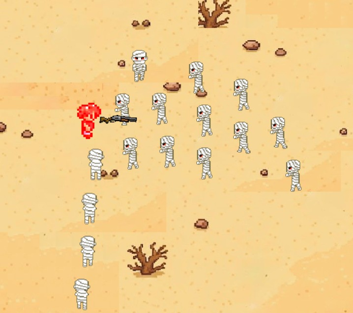
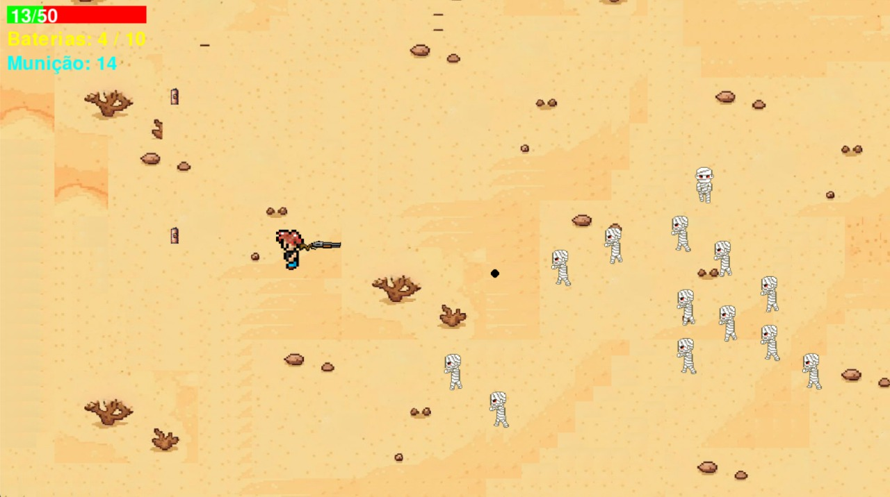

# 🎮 Mad Mumia

> **Projeto final de IP**  
> Um jogo desenvolvido com **Pygame**, combinando combate, coleta de itens e gerenciamento de recursos.

---

## 👥 Integrantes
- Samuel Serbim Soares (sss9)
- Matheus Vitor Jose de oliveira (mvjo)
- Guilherme Duque Lima Luizines Van Leijden (gdllvl)
- Guilherme Laurentino dos Santos (gls8)
- Heitor Nascimento Briano (hnb)
- Heitor Brazil Nobrega (hbn)

---

## 🏗 Arquitetura
A organização do código foi dividida em módulos para garantir a separação de responsabilidades.

### `main.py`
Responsável por administrar o loop de jogo, o que inclui o desenho de objetos e interfaces, a captura de inputs do jogador, o controle de som, a chamada de métodos e a criação de objetos. Também gerencia o menu e parte da funcionalidade da câmera.

### `image.py`
Contém a classe set_image, utilizada por conveniência para criar e manipular imagens.

### `entidades.py`
Contém as classes de entidades que são instanciadas durante o loop de jogo, como Inimigo, Bala, Jogador e ArmaFlutuante.

### `coletaveis.py`
Contém as classes dedicadas aos itens coletáveis, como Coração, Baterias e Balas, mantendo-os separados das outras entidades.

### `camera.py`
contém a classe câmera, que permite o enfoque numa parte menor que do mapa, seguindo constantemente o player. Será instanciada em main. Converte coordenadas de tela para coordenadas de mundo para evitar conflitos (afetava a mira e rotação da arma).

### `audiomanager.py`
cria a classe AudioManager, com nome autoexplicativo (gerencia o áudio). É instanciada na main para realizar o manejo dos áudios executados.

### `paredes.py`
define a classe Parede por conveniência para ser utilizada com barreira invisível.

---

## 📸 Capturas de tela
>
> 
> 
> 
> 
> 
> )
> 

---

## 🛠 Ferramentas, bibliotecas e frameworks

<strong>Pygame</strong> — É o principal framework utilizado para a construção do jogo.

**Justificativa:** A biblioteca é empregada para gerenciar o loop principal do jogo, renderizar gráficos e textos na tela, capturar eventos de teclado e mouse, e controlar a reprodução de áudio e música. Também é a base para a criação e gestão de todos os elementos visuais, como o jogador, inimigos, e itens, através de Sprite e Surface.

<strong>random</strong> — Biblioteca padrão do Python utilizada para introduzir aleatoriedade no jogo.

**Justificativa:** É usada especificamente no arquivo main.py para escolher posições aleatórias para o spawn dos itens coletáveis, como corações, balas e baterias, garantindo que a disposição deles varie a cada partida.

<strong>math</strong> — Biblioteca padrão do Python empregada para realizar cálculos matemáticos complexos.

**Justificativa:** É fundamental no arquivo entidades.py para a mecânica de mira e tiro. Funções como math.atan2, math.cos e math.sin são utilizadas para calcular o ângulo da arma em direção ao cursor do mouse e para definir a direção e trajetória das balas disparadas pelo jogador.

<strong>Tiled</strong> — Ferramenta para elaboração de tilemaps.

**Justificativa:** Essencial para otimizar o fluxo de criação do mapa, além de permitir um debug mais eficiente do que caso utilizássemos alguma ferramenta de criação de imagens simples.

<strong>Gemini</strong> — Consultor para achar erros rapidamente (otimizando o fluxo de criação) e gerar imagens das telas de menu, derrota e vitória.

**Justificativa:** Dado o tempo apertado, ter o gemini como consultor foi de grande ajuda, dado que se precisássemos, por exemplo, desenhar a arte da tela de menu manualmente, teríamos levado facilmente uma tarde. Além de poupar horas e horas de debug em busca de algo simples que passou despercebido.

---

## 📋 Divisão de trabalho
- Samuel Serbim Soares - sistema de combate (mira/tiro do player, dano do inimigo); sistema de vida do player; controle de versionamento.
- Guilherme Laurentino Santos - movimentação do player, lógica de inimigo, arma flutuante que rotaciona; Paredes.
- Guilherme Duque Lima Luizines Van Leijden - Seleção e aplicação de sprites, lógica de animação, garantia da qualidade e o funcionamento correto do jogo, correção de bugs, balanceamento da jogabilidade.
- Matheus Vitor Oliveira - Escolha e mixagem de áudio — Responsável pela parte sonora do jogo, com mixagem geral das músicas e sons para garantir equilíbrio e imersão. Realizando ajustes de volume, definição da sonoridade e aplicação de efeitos sonoros nas interações. Implementada uma classe para organizar também as imagens, assegurando integração fluida com a gameplay.
- Heitor Brazil Nóbrega - Desenvolvimento de animações de colisões — Implementação e otimização de efeitos visuais e feedbacks dinâmicos para interações no jogo, integrando física, sprites e transições de animação.
- Heitor Nascimento Briano - Implementação da lógica de interação e coleta dos itens pelo jogador e o comportamento da câmera para seguir o personagem.

---

## 💡 Conceitos utilizados
Quase todos os conceitos (com exceção de recursão) foram utilizados no projeto, com destaque para:

- funções - criação de métodos dentro das classes instanciadas.
- laços de repetição - disposição de elementos na tela, loop principal do jogo, captação de inputs.
- tuplas - grande parte dos argumentos passados aos métodos nativos do pygame deviam ser no formato de tupla.
- listas - armazenar conjuntos de objetos, como os inimigos em cena e as balas disparadas. 
- Dicionários - Essenciais para organizar o sistema de animações do jogador e dos inimigos. Um dicionário foi utilizado para mapear o estado da entidade (por exemplo, a string 'direita_andando') à sua respectiva lista de frames de animação, simplificando a lógica para selecionar a imagem correta a ser exibida.

---

## 🧩 Desafios, erros e lições aprendidas

### Maior erro
nosso maior erro foi criar um main que foi quase monolítico por volta do meio do projeto, isso dificultava muito a legibilidade e compreender onde começava e terminava cada sistema (e como eles interagiam entre si). Foi resolvido modularizando mais a codebase.

### Maior desafio
o maior desafio foi, certamente, conciliar o projeto com o fechamento do período e, consequentemente, das outras cadeiras (última prova regular, apresentações, preparações para prova final). Lidamos com isso dividindo o trabalho no tempo baseando-nos em quão sobrecarregado um grupo de pessoas estava e delegando as atividades ao grupo menos sobrecarregado. Por exemplo, na primeira semana do projeto, os integrantes de CC tiveram a P3 de Matemática Discreta, apresentações de Concepção de Artefatos Digitais e parte em Sistemas Digitais. Na última semana, todos trabalhamos intensivamente (viramos uma noite, inclusive) para garantir a entrega do projeto.

### Lições aprendidas
desenvolver e exercitar comunicação assertiva foi essencial, dado que, muitas vezes, os sistemas desenvolvidos por uma pessoa teriam impacto/interação direta com os de outro integrante. Aprender/exercitar versionamento com git/github foi interessantíssimo, e percebemos que se utilizássemos meios mais rudimentares (como uma pasta no Drive), teríamos muito mais dor de cabeça.
